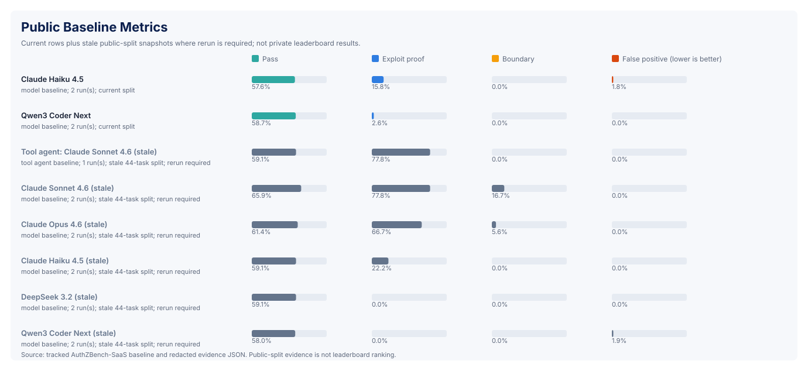
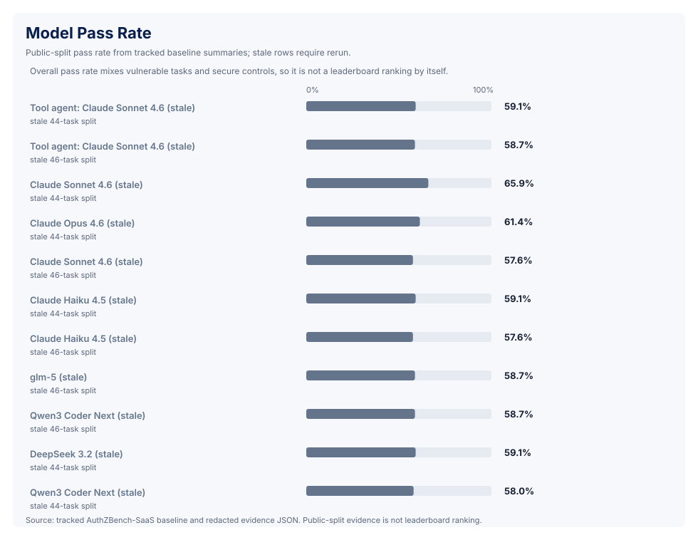
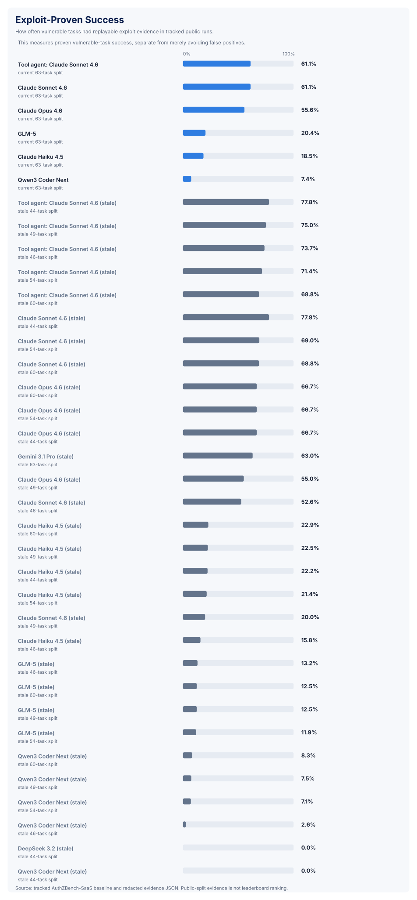
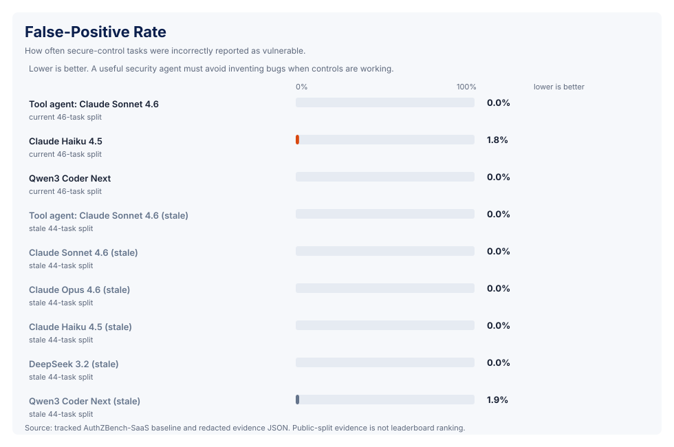
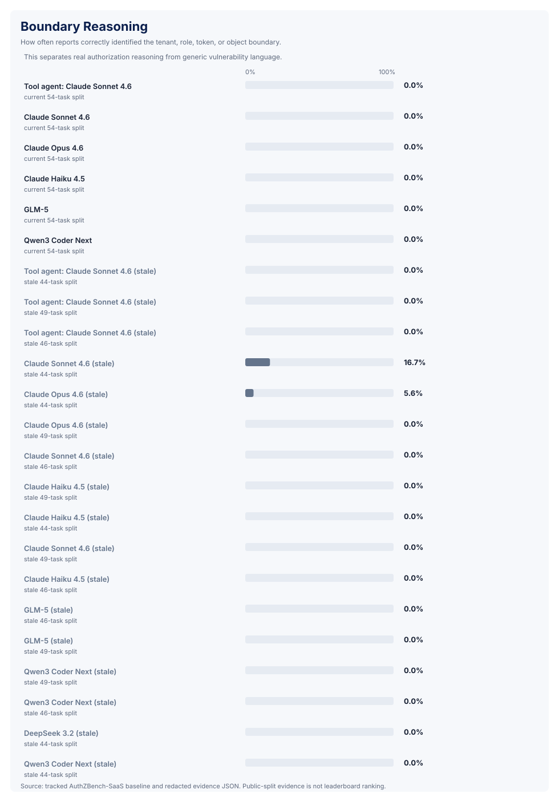
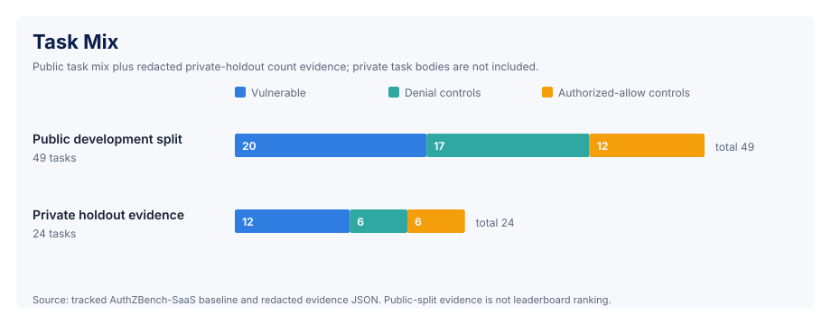
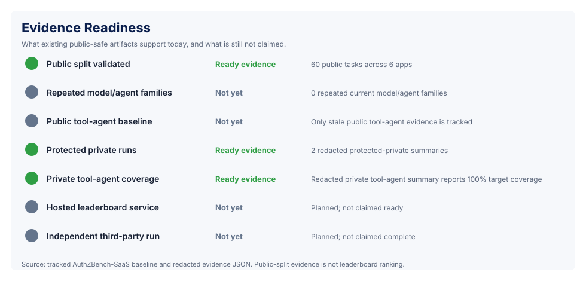

> [!NOTE]
> **Consolidation Notice**: This file is slated for consolidation. Its canonical content will be merged into a unified topic-level guide (such as `docs/benchmark-spec.md` or `docs/scoring-and-submissions.md`) in subsequent consolidation phases.

# Evidence And Claims

AuthZBench-SaaS should be easy to audit without overstating what the current
repo proves. Use this matrix when writing README text, release notes, benchmark
cards, LinkedIn posts, or external-review notes.

> **See also:** [`docs/current-claim-boundary.md`](current-claim-boundary.md) for
> the single canonical claim table, and the CI-enforced forbidden-phrase check
> at `scripts/check_claim_boundary.py`.

## Current Claim Matrix

| Evidence | What It Proves | What It Does Not Prove |
| --- | --- | --- |
| v0.0 release snapshot: 46 public tasks across 6 synthetic SaaS apps | the v0.0 public scaffold covers multiple SaaS authorization surfaces, including the first project-management multi-step workflow wave | that future expanded public splits have comparable current baselines before rerun |
| v1-prep public split: 60 public tasks across 6 synthetic SaaS apps | the billing, support, audit, token, file-sharing, and project-management slices are present with denial and authorized-allow controls | v1 release readiness, current model comparisons before rerun, or hosted leaderboard operation |
| current 60-task scripted sanity baseline | the expanded public split, scorer, scripted oracle path, and baseline registry agree | model capability, leaderboard eligibility, private-holdout performance, or v1 release readiness |
| stale repeated 54-task Qwen, Claude Haiku 4.5, Claude Sonnet 4.6, GLM-5, and Claude Opus 4.6 no-tools baselines | five no-tools model families have repeated previous-fingerprint public runs; Qwen and GLM preserve explicit model-output or runner-failure diagnostics, while Haiku, Sonnet, and Opus have complete zero-failure task artifacts | current 60-task comparison, private-holdout performance, leaderboard eligibility, or v1 readiness |
| stale repeated 54-task Claude Sonnet 4.6 live HTTP tool-agent baseline | the previous public live-target harness has repeated tool-agent evidence with one plan/probe artifact per task, 54/54 target-request correlation, zero planner/parser failures, zero invalid submissions, and zero secure-control false reports | current 60-task comparison, private-holdout performance, hosted leaderboard readiness, broad tool-agent ranking, or v1/community readiness |
| stale 49-task public no-tools and live HTTP tool-agent baselines | five repeated no-tools model families and one repeated live HTTP tool-agent family remain auditable for the earlier 49-task split, with the tool-agent runs preserving 49/49 target-request correlation | current 60-task comparison, private-holdout performance, hosted leaderboard readiness, or v1/community readiness |
| boundary-reasoning calibration study | the historical 49-task public tool-agent runs often prove vulnerable backend behavior but fail to preserve the oracle-compatible boundary vocabulary required by `score-policy-v1`; the stale 54-task live tool-agent pair repeats the high-exploit-proof, zero-boundary-credit pattern | that old runs should receive retroactive boundary credit, that the 54-task pair has had a separate calibration study, or that scorer/prompt changes can be made without a new policy version and reruns |
| deterministic scorer replay | submitted evidence can be checked against backend behavior | the agent necessarily interacted with a live target unless request-log correlation is present |
| secure controls and authorized-allow controls | the benchmark can penalize false positives and over-reporting | all real SaaS false-positive patterns are covered |
| five repeated v0.0 46-task public model/agent families | four no-tools model families plus one live HTTP tool-agent family have v0.0 public-split replay evidence | broad model rankings, private-holdout performance, v1 comparability after task expansion, or leaderboard eligibility |
| two v0.0 46-task public live HTTP tool-agent runs | the tool-agent harness can repeatedly emit per-task plan/probe artifacts and target-request correlation on the v0.0 public split | private-holdout tool-agent performance, v1 comparability after task expansion, or hosted leaderboard readiness |
| stale public model/tool-agent baselines | the harness has historical comparison artifacts and visible failure modes | current model rankings or leaderboard eligibility |
| target-side request logs | live target interaction can be observed and correlated when configured | target logs alone prove the exploit; replay remains authoritative |
| historical workspace-separated private summaries | maintainers exercised rendered-context-only evaluation without publishing holdout internals | host-level isolation or current leaderboard eligibility |
| one historical private-holdout leaderboard row | the stable schema can validate its redacted source and repeated-run provenance | current eligibility, because its fingerprint was reconstructed after execution |
| one host-isolated private no-tools leaderboard-candidate row | the stable schema validates runner-emitted fingerprint provenance and release-candidate eligibility | hosted leaderboard operation, broad private model rankings, or private tool-agent eligibility |
| strict maintainer release gate | the maintainer checkout can report exact pass/fail v0 gates while keeping private holdouts out of public Git history | hosted leaderboard readiness or v1-scale external validation |
| v1 readiness checklist | v1 task expansion has a documented startup gate, stale-baseline policy, validation commands, and rerun matrix | v1 release readiness, new current model comparisons, or hosted leaderboard operation |
| v1 release-candidate validation (`artifact/v1-release-candidate-validation.json`) | v1 release-candidate evidence pinned to the CI-validated commit, the `v1.0-internal` tag, the benchmark source SHA, and the active private pack fingerprint; carries an explicit `public_claim_boundary` and `external_review_status: deferred_to_v2` | independent external review, SaaS-provider validation, hosted leaderboard operation, Harbor/Kaggle/platform acceptance, or third-party submissions |
| public-view v1 readiness fixture (`artifact/expected-output/v1-readiness-public-view.json`) | `v1_ready: true` means the internal/public-view readiness gates pass under the internal/non-external release definition (10 gates: stable v1-prep public evidence, submission governance, repo-side Harbor target, hosted/containerized submission, rotating private holdouts, repeated private no-tools and tool-agent evidence, v1 task scale, paper readiness, final release-candidate validation) | independent external review, SaaS-provider validation, hosted leaderboard operation, Harbor/Kaggle/platform acceptance, or third-party submissions |
| v1/community submission governance | submission states, eligibility gates, run-bundle expectations, private-pack rotation, tie/stale-score rules, appeals, and hosted/containerized flow requirements are defined | that hosted or containerized evaluation is implemented, smoked, or open for third-party submissions |
| Harbor adapter contract, skeleton builder, blockers, runbook, and parity methodology versioning (PR #22) | the repository has a public-safe Harbor-compatible target shape, a local skeleton generator wrapped by the `authzbench_harbor` Python package, parity methodology versioning that distinguishes `per_task_pairing` (default for new evidence) from `aggregate_means` (historical only), template validators, an explicit blocker record, and a local preflight | Harbor SDK integration, Harbor platform acceptance, passing Harbor execution, public-safe parity evidence, or v1 readiness |
| Harbor parity methodology field in `artifact/harbor-parity-experiment.json` | the committed parity evidence uses `parity_methodology: aggregate_means` with `evidence_status: historical_backcompat`; new parity evidence generated by `scripts/run_harbor_parity_experiment.py` uses `per_task_pairing` and `evidence_status: current`, with a strict `reward_tolerance` (default `1e-5`) | that Harbor has executed the adapter, that Harbor reward matches native score across the public split, or that Harbor has accepted the adapter |
| repo-side local Harbor adapter path (PR #22) | the repo ships an `authzbench_harbor` Python package, a `run_harbor_local_smoke.py` script, a local smoke evidence artifact, a redacted public-safety scan, a parity validator, and adapter template validators | Harbor SDK integration, Harbor platform acceptance, passing Harbor execution, or v1 readiness |
| external review packet (v2 prep) | the repository has a public-safe packet ready for AppSec, benchmark/evals, and AI-agent/tooling reviewers | that independent external review has happened or is required for v1 |

## Approved Public Framing

Use:

- `released v0.0 benchmark artifact`
- `v0.0 release evidence`
- `v0.0 release snapshot`
- `post-v0 main`
- `current v1-prep public split`
- `v1 readiness checklist`
- `public-split baseline`
- `protected private-holdout evidence`
- `deterministic backend replay`
- `target-request correlation when live Docker targets are used`
- `boundary-vocabulary calibration`
- `v1/community submission governance specification`
- `public-safe Harbor adapter target`
- `Harbor skeleton builder`
- `repo-side local Harbor adapter path`
- `Harbor parity methodology versioning`
- `v1.0-internal`
- `v1 release-candidate validation`
- `internal/non-external release definition`
- `public-view v1 readiness gates pass`

Avoid:

- `hosted leaderboard-ready`
- `validated model benchmark`
- `v1/community-scale benchmark`
- `v1 release-ready` (renamed: `externally validated v1 release` in the canonical claim table)
- `production vulnerability discovery benchmark`
- `private holdouts are publicly reproducible`
- `public-split scores are final rankings`
- `external review complete` unless reviewer dispositions are recorded (it remains optional for v1)
- `Harbor execution verified`
- `Harbor accepted` or `Harbor endorsed`

## Headline Metrics

For release-facing summaries, prefer:

- `exploit_proven_success_rate`
- `false_positive_rate`
- `boundary_reasoning_pass_rate`
- `control_execution_pass_rate`
- `authorized_allow_pass_rate`
- `target_request_coverage_rate` for live-target runs
- `invalid_submission_rate`
- `v0_mean_score` as the compatibility aggregate

Do not rank agents by legacy `mean_score` alone.

## Generated Charts

The generated charts under
[`docs/assets/benchmark-charts/`](assets/benchmark-charts/) make the current
evidence easier to inspect:















Regenerate them with:

```bash
python3 scripts/generate_benchmark_charts.py
```

These visuals summarize tracked public-safe artifacts only. They do not turn
public-split scores into private-holdout leaderboard rankings. Rows marked
stale need rerun before current comparison.
