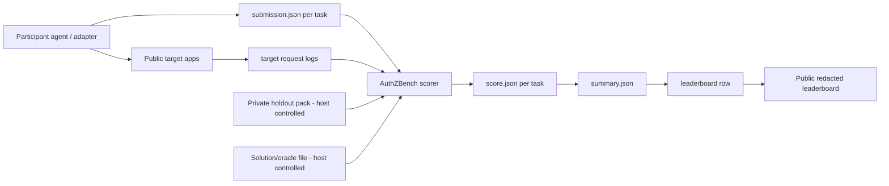

# Host Architecture Flowchart

This document outlines the architecture and data flow for the AuthZBench-SaaS evaluation loop.

## Key Architectural Principles
- **Public Task Manifests**: Committed directly to Git under `tasks/` for reviewer visibility and local testing.
- **Private holdouts**: Excluded from public Git and loaded in custody by host-controlled scorers.
- **CSV Index**: The participant-facing CSV acts as a row index pointing to evidence/findings files within the submission bundle.
- **Evidence-Based Scorer**: The scorer is authoritative and evaluates replayable evidence and HTTP request correlation rather than simple label matching.
- **Redacted Leaderboard**: Leaderboard rows published publicly display only count-level summaries and fingerprints to protect holdout secrets.
